# Design In Ply

Design In Ply is a website for a company based in Co. Dublin. They design and make bespoke plywood furniture for the domestic and commercial sector. This website is to help customers find their business, see examples 
of their work, and get a feeling for the ethos of the company.It will also allow people to connect to their social media links, where they can see more information and examples of their work.

 It targets people interested in one off high quality pieces of furniture. Not meant to be a place to buy off the shelf products, but to encourage people to contact them directly to commision a piece. The idea of the site is minimalist, and clean, giving enough information to intrigue interest.But without too much clutter, to confuse or limit what customers think the possibilities might be. Hoping the simple design will trigger the same feelings as the clean modern design of plywood funiture.

***

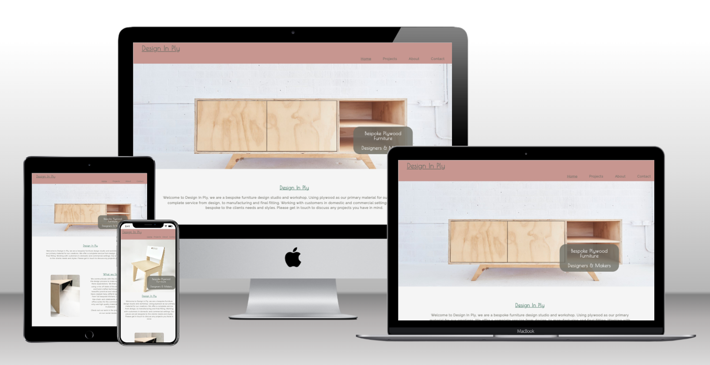 


***

## UX/UI

- The design of the website has user experience at its core, meant as a showcase for the work the company creates. Imagery dottted throughout to intrigue the user and keep them on point, to what they are there for. 

  - It is meant to be easy to find the content, in very obvious and straight to the point sections. Although there is 4 nav links, there is only 3 pages. The user will end up on the contact form, if the about page has been clicked and scrolled through. Throughout the site there are multiple reminders, to get in touch or visit their social media links, and their contact info is right at the top of the footer on each page, the message is clear, to contact the company directly. This is not an ecommerce site, but more of a showcase. It is aimed at people looking for high quality one-of bespoke pices of furniture. Not praying on impulse buys, but the consumer who is looking to spend a bit more money to get something unique and made to their needs.

  - The site is built to flow with ease from, some basic information about the company, to more detail about what they do, on to examples of their work, and more in depth information about the founder and his ethos.

  - The content is also easy to navigate. From links highlighting and underlining when hovered to current/active pages underlined.
  When clicking on the contact page/section the browser slides down to the bottom of the about page, letting the user know where they are. 

  - If the user fills out the contact form, and submits, they will be sent to a confirmation page, this lets them know their message was sent. This page will then re-direct them to the home page after 10 seconds, pointed out to the user by a message on the page. This prevents the user having to interact with the back button on the browser window, but only interacting with the site.

  - The social media links also only open in a new tab keeping the site tab open for them.

  - The style of the site is meant to link to the style of the furniture the company make with clean lines and open spaces with subtle design traits, hopefully appealling to the users who are attracted to the modern plywood furniture design offered. 

  - The small detail of the double underline on the logo when hovered is a homage to the exposed edges of plywood, with parrellel lines. 


__Colour Scheme__
    
  - The colour scheme for the site was chosen as a way to keep the asthetics looking simlpe and clean but still being able to introduce some colour, and not have it all in white and black / grey. Small amount of colour was used, which allow the photos to do all the hard work, impressing users.

    - The colour scheme consists of a background colour of  : #f5f5f5. 
    An off white, to give contrast to the photos, but not be too stark like a brilliant white.
    
    - Text is in a grey,  rgb(55, 55, 55,)  quite close to black but a bit softer.


    - The main accent of colour comes in the header and footer section. Both with a background of a dull pink colour rgba(189, 128, 118, 0.8). This becomes the main theme/colour of the site despite only being in two small areas of the site, and doesnt affect the photos which still sit on the white backgrond. 
    
    
    - The lower headings of the site are also picked out. These headings title the paragraphs throughout the site, they are coloured with a very complementary green. It is only a subtle contrast to the main text colour and not noticeable straight away, but I believe gives it a bit of class.

    - The colour scheme was implemented with root variable code in the top of the CSS file. This gave me the flexibility to change around and adjust the colours, without having to change them all at the element level throughout the CSS file.
    Below is a code block of what I used in the css.


```css
 :root {
  --white: #f5f5f5;
  --pink: rgba(189, 128, 118, 0.8);
  --pink-solid: rgba(189, 128, 118, 1);
  --dim-grey: rgba(55, 55, 55, 1);
  --dark-green: rgb(66, 117, 99);
  --dim-grey-trans: rgba(109, 109, 100, 0.8);
}
```


__Typography__

- The fonts chosen for the website, are "poiret one" for the headings and  logo, and "raleway" for the body of all the text. The back up is sans seriff, incase it is not supported by a particular browswer.

  - Chosen to be clear and stylish, with some beautiful details in the poiret one in particular, the font helps with the user expierience

  - These fonts come from google fonts. I used FontJoy to compare and pair fonts to find two options that work well with each other.

  - They were imported in to the top of the CSS file, from Google Fonts, and then selected for their desired elements within the CSS.  

  - Icons are also used in the project. For links to the social media sites, I used an icon for each of these social media sites.
  For this I used font-awsome, with a kit, where some code is supplied by font awsome, and added into each html file. 

  - This then allows me to add the icons that I pick from the font awsome library. Simple and affective.


__Favicon__

- A favicon has also been used in this project. This is a small icon that shows up on the left hand corner of the tab for a site, in a browser.
It allows the user to differenciate which site is on which tab, when there is multiple tabs open in a window of a browser.

  - This is done by adding a link inside the head of each html file, linking to a small image from the images folder.

  - This can really help with user experience, allowing for easy navigation back to the site if the tab has been left open.


***

## Features
In this section I will outline and explain the different features of the site and its layout.


__Logo__

- The Logo, which is located on the header section of each page, is a simple one. The name of the company Design In Ply, with a nice font "Poiret One" an underline, text decoration. It is located to the far left of the header and is placed in the same location on each page, and at all screen sizes, keeping the site easy to navigate. It only moves by a few pixels right and down as the page expands above 700px wide, to keep with the open asthetics of the overall site. The logo is a hperlink to the home/landing page, clickable from anypage. As the user hovers over the logo or clicks the underline doubles, showing a little take on the lines found in plywood edges. The colour also changes to black, a subtle change to show interation with the logo

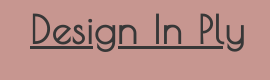

 __Navigation Bar__


- The navigation bar, is located to the right of the header section. Containing 4 links to 3 pages. The "Home" links to the home/landing page, the "projects" links to a gellery of previous projects, the "About" links to the top of an about/contact page, where there is some information about the foundation and ethos of the company, and finally the "contact" links to the lower half of the about/contact page, where there is contact info along with a contact form, and live iframe of the location on google maps. The nav bar is styled with the other font used on the site "raleway". The whole word of the link higlights in black when hovered over, and and an underline appears. The colour of the text when not hovered is also in the dim grey used widely throughout the site. like the logo the nav bar links are located in the same position on all pages and on all screen sizes with some extra spacing between them on larger screen sizes. Again keeping the site intuitive. The nav bar does come closer to the left side and slightly under the logo on very small screen sizes, But I feel not cluttering the header.


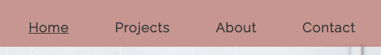

__Header__

- The header section of the site is a banner accross the top, housinng the logo and the nav bar links. It is coloured in a dusty pink/terracota colour, with a slight transparency. It is fixed to the top of the viewport window, meaning it moves down with the user as they scroll through the site. Giving the user access to the other links at any point on the page, removing the need to scroll back to the top. This is where the slight transperency comes in. It doesnt completly obstruct the view of content underneath, and stops the viewport looking too small under the banner. I felt it also helped to bring the colour down through the page, keeping the theme consistent, and meaning the rest of the page can be left white and minimalist.

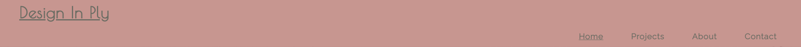


__Hero Image__

- Below the header banner there is a main / hero image. This is a place to showcase some of companies work, and imediately give meaning to the site. It lets the user quickly see what the company does and helps to create the theme of the site, showcasing their work. The image runs across the whole width of the page and and the majority of the height of the page before scrolling.
It is resopnive and takes up similar amount of real estate across all screen sizes. The image changes between to photos for larger and smaller screens. At larger sizes it is a beautiful photo of a plywood side-board in a white room. At smaller sizes below 700px wide screens, it is a stunning photo of a plywood chair again on a white / off white background, putting the furniture pieces as the main focus of the hero image. When scrolling down the image stays in the flow of the page while the header sticks to the top floating over the image. This Image is the same across all pages bar the confirmation page, only seen after the user has completed and submitted the contact form.
Laid over the hero image is some text, placed in a grey transparent box, with white text, the same off white as the background of the main body of each page. A simple tagline for the company is written here "Bespoke Plywood Furniture, Designers & Makers"
Placed in the same area of the hero image on all pages and screen sizes. The shape of the box has large rounded corners, which features on all sloid elements throughout the site, like images and form boxes. Purpose is to immediately give context to the website and what the company do.

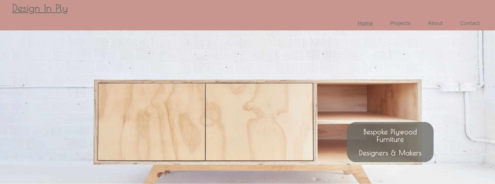

__General Company Description__

- On the home page, directly below the hero image is the first bit of text content the user will come across. It is a brief descriptioon of thecompnay and what it does. It consits of a heading in the same font as the logo with an underline decoration, in keeping with the style theme, but picked out in a different colour with a very slight contrast to the rest of the text, in a deep earthy green. Below that is a short text paragraph in the "raleway" font and in the dim grey colour.
Both the heading and paragraph is center aligned to the middle of the page. This appears the same across all screen sizes.

- sBelow this paragraph there is 4 more sections, Two more text paragraphs with headings, and two images. Each text paragraph is associated to an image by layout Each pair is in a section controlled by flex box properties in the CSS. In the smaller mobile screen sizes the appear on top of each other. First an image then text then image and finally another text parragraph. All sitting on top of each other vertically. When viewed at larger screen sizes the images move tho opposite side of the window with the text paragraphs sitting to the other sides of each image horizontally. The images stay the same size while the paragraphs spread to take up more space but still aligned centrally in the space the take up.
This keeps the site coherent and flowing in all screen sizes. The text content in these sections are more info on the company, broken into "what we do" and "why we do it" themes.

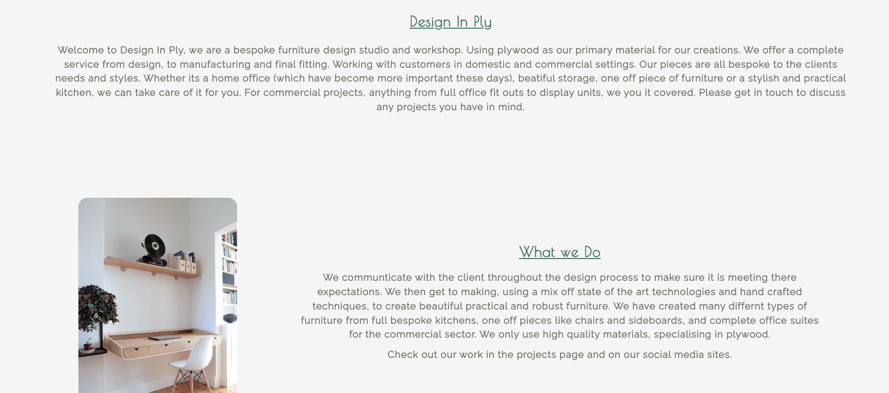 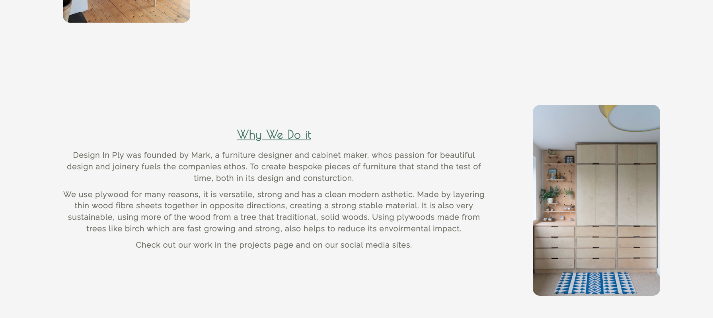 

__Footer__

- The footer section aesthtcally matches the header, it is styled with the same colours for text and background as header. Again giving a nice flow to the site, making it clear the user is at the end of the page, with that background colour only been used at the top and bottom of page, framing it. Within the footer there is basic contact info. First is an email address, which is a link to bring the user to an email editor on their browser to send an email to the address. Below this is the address of the company and below that their phone number. Then underneath that is 3 icons each one a link to the companies social maedia site, Facebook , Intagram, and Youtube. Again this is kept simple with plenty of space between content, and all the relavent info needed for the user to get in touch with the company, easy to find. Always in the same place and same layout across all pages and screen sizes. The last line on the footer is just a basic copyright statement.

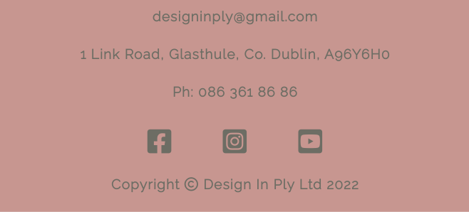

__Previous Projects Gallery__

- The "projects" page consists of images and brief descriptions of previous work the company have completed. The page layout matches the home page with header, footer and hero images.
The gallery is made with flex box properties, making it fully responsive to different screen sizes. Changing from one image on top of each other vertically, to two side by side all the way up to 3 in a row, horizontally on the largest screen sizes. The image description in directly under each image. All the images like everywhere else on the site are styled with rounded corners, continuing the style through out the pages 

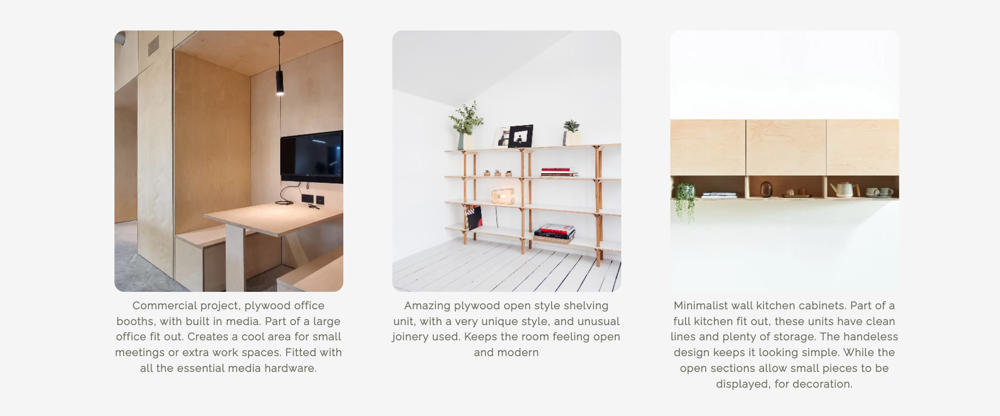


__About Section__

- The about section starts at the top of a page with a in-depth description of the companies foundation and what they do. It is styles the same as the first piece of text at the bieginning of the home page, centered and coloured withe the same colours.
This page also includes the same header and hero image as the others.
Below this paragraph, are two circular photos, the only two styled differently, but still inkeeping with the rounded off corners of all the other images. these are also the only photos not  of pieces they have completed, but images of the workshop and studio. Justifing the different styling.  

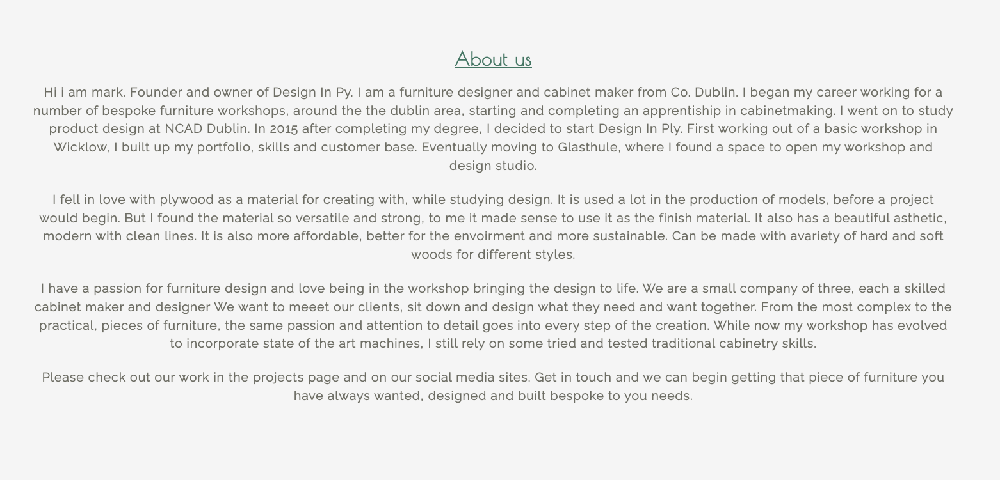 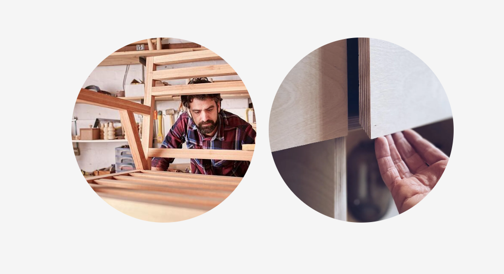


__Contact Section__

- On the about page there is the contact section. linked to by its own link in the header of each page but technically the second part of the about page, hopefully bring user to this section more frequently, than been on a seperate page.
As the main contact info is on the footer of each page anyway, this section is based around a contact form, with a name email and message input field. Form is styled in keeping with sites them, with rounded corners. The textarea message input has place holder text, outlining what to add here.
Below this is an iframe element, showing a live location of the companys studio, on Google Maps. Again styled like the other images on the website.

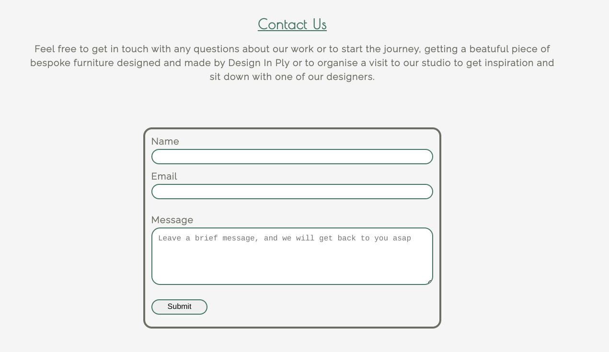 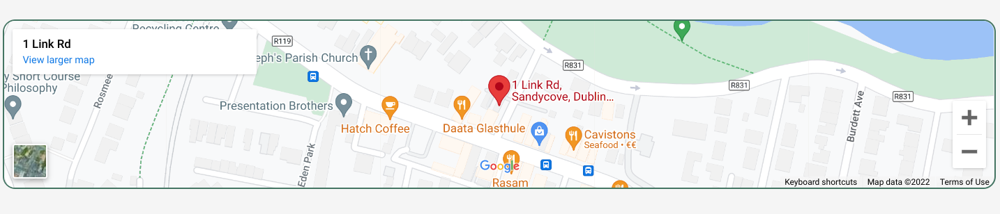


__Confirmation Page__

- When the conact form from the contact section has been completed, and subitted, with the name field completed and a valid email address added the user is brought to a confirmation page. this page very brifly thanks the user for getting in touch, confirms they will get a reply shortly. again encouraging the user to visit their social media links.
This page is very simple only keeping the header and footer off the other pages, losing the hero image.
The head of this page has code which redirects the user back to the home page within 10 seconds. This is stated on the page, and prevents the user having to interact with the back button while visiting the website.

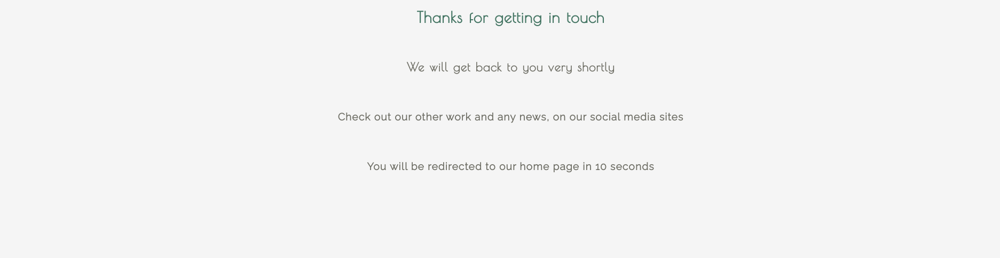


***

## Future Features

- In the future there are a few features, that this site could benefit from, to increase its scope.

- In the gallery page, it would be a nice feature to be able to interact with each photo, which would open up another gallery / slideshow with more photos of that specific project, that could be manually flicked through or left on a auto slide. Not in a sepeate page but just floating over the gallery page.

- The site's hero image could possibly also benifit with this being an auto slide show of images showcasing some of their pieces with different cover text over each one stating other taglines, also allowing the user to push through each photo manually.

- If the company decided to start pre making some limited small pieces of furniture or plywood accesories, the webite could incorporate an e-commerce section.

***

## Testing


- For all testing please refer to the [TESTING.md](TESTING.md)

***

## Deployment

The site was deployed to GitHub pages. The steps to deploy are as follows: 
  - In the [GitHub repository](https://github.com/dylankane/Design-In-Ply), navigate to the Settings tab 
  - From the source section drop-down menu, select the **Main** Branch, then click "Save".
  - The page will be automatically refreshed with a detailed ribbon display to indicate the successful deployment.

The live link can be found [here](https://dylankane.github.io/Design-In-Ply)

### Local Deployment

You can clone the repository by following these steps:

1. Go to the [GitHub repository](https://github.com/dylankane/Design-In-Ply) 
2. Locate the Code button above the list of files and click it 
3. Select if you prefer to clone using HTTPS, SSH, or GitHub CLI and click the copy button to copy the URL to your clipboard
4. Open Git Bash or Terminal
5. Change the current working directory to the one where you want the cloned directory
6. In your IDE Terminal, type the following command to clone my repository:
	- `git clone https://github.com/dylankane/Design-In-Ply.git`
7. Press Enter to create your local clone.

Alternatively, if using Gitpod, you can click below to create your own workspace using this repository.

[](https://gitpod.io/#https://github.com/dylankane/Design-In-Ply)

Please note that in order to directly open the project in Gitpod, you need to have the browser extension installed. A tutorial on how to do that can be found [here](https://www.gitpod.io/docs/configure/user-settings/browser-extension).

## Credits

Here I will list sources that I used for to build the site, broken into three catagories, code, content and images.

__Code__


- Flexbox was a display property I was unfamiliar with, at the  beginning of this project. Thanks to the sources below, I was able to implement it in this project in a few places. Primarily the gallery of images, was built with the code in the "logrocket article" stripped back a bit and adjusted to meet my needs, leaving out the hover attribute to make it more mobile friendly. The other source was a video on youtube by Web Dev Simplified, to learn the basics of flexbox. This helped me with the knowledge to use this property in other areas of the project.

https://blog.logrocket.com/responsive-image-gallery-css-flexbox/

https://www.youtube.com/watch?v=fYq5PXgSsbE&t=322s


- When fixing the header to the top of the viewport, I found an article helping me to position it where I wanted it. After coming across some issues this helped me correct it.

https://stackoverflow.com/questions/18747466/div-disappears-on-positioning-it-fixed


- Below is a link to a page on W3Schools with information and code I used to help style elements in the contact form. With this example of code I could adapt it to style my contact form the way I wanted. Using "box-sizing" with the input[type = ].

https://www.w3schools.com/css/css_form.asp


- While designing the site, I decided I would like the "about" and "contact" sections on the one page, but linked to, with seperate navigation links in the header. Here is a source that helped me implement that. A previous question asked in a forum "stack overflow" with help from a few members.

https://stackoverflow.com/questions/17687328/getting-a-link-to-go-to-a-specific-section-on-another-page

- I used root variables in the CSS for colours across the project, allowing me to change and perfect my colour choices, without having to go to each individual elementt to change it. I used the information in the link below from w3 schools to help me implement these.

https://www.w3schools.com/css/css3_variables.asp

  - I used a 10 second re direct from the confirmation page after sending contact form. Keeping the user from having to interact with the back button. Using a bit of code in the heaad of the confirmation page.

  ```html
  <meta http-equiv="refresh" content="10; url=index.html">
  ```

  I got some great specific help with this from my mentor in code institute, Tim Nelson

  - I also got some great help from Tim Nelson, on getting the contact section to scroll / slide into view when clicking on the contact link with the CSS 

  ```css
  html {
    scroll-behavior: smooth;
  }
  ```

  Tim also helped me with code for the favicon,


***

 __Content__

- There are two websites of similar companies, which gave me ispiration for the design, and helped with ideas for content, and how to structure the content.  

https://www.lozidesigns.com/

https://www.madeinply.co.uk/

https://www.madeplyhand.co.uk/

***

__Media__


- Below is a list of urls where I have found all the images on this site


- Hero Images

https://www.elosilo.com.au/product/memi-tv-cabinet/ (hero-sideboard.jpg)

https://mapayah.com/products/seat (chair.webp)


- Home page

https://www.pureviewcarpentry.co.uk/plywood-wardrobe-with-pegboard (bedroom-plywood-units.jpg)

http://www.nogoatforjack.com.au/work-office-tables (office-furniture-plywood.png)


- Gallery

https://www.grundig.com/ktchnmag/blog/how-sustainable-plywood-is-changing-the-way-we-design-kitchens/ (plywood-kitchen.jpg)

https://www.lozidesigns.com/commercial/the-point-theatre (plywood-bench-stool.jpg)

https://www.lozidesigns.com/shop/p/shelving-system (shelving-unit.jpg)

https://jsdeco.co.uk/plywood-service-wall/ (office-suite-commercial.webp)

https://www.madeinply.co.uk/ (triple-kitchen-cabinet.webp)

https://unsplash.com/s/photos/plywood-furniture (birch-ply-bunk-bed.jpg)

https://archello.com/product/wall-units-frisk (birch-ply-shelving.jpg)

https://www.madeplyhand.co.uk/bespoke-plywood-furniture/ (music-center.jpg)


- About Page

https://www.dreamstime.com/photos-images/artisan-furniture-designer.html (furniture-workshop-image.jpg)

https://www.madeplyhand.co.uk/ (plywood-joinery-hand.webp)


## Technologies Used

- To Build this project I used the following tools and technologies:

  - Html: The basic building block of the site, used to write and structure the content of the website

  - Css: The technology used to style the Html. By identifying certain elements the html, and apointing attributes to them, Css code can style the content in many ways, from layout to text colour, and everything in between.

  - GitHub: Is an online software development platform. Used for storing, tracking, and collaborating on software projects.
  Creating a repisitory on github, then developing it in a workspace (git pod) into the finished project, storing it and eventually deploying it through github.

  - Gitpod: This is a envoirment in which you can develop your project. A cloud based IDE. A workspace to develop and code, while launching live previews and consistently storing everything to github.

  - GitHub pages: Used to deploy repositories from Git Hub 

  - Google Fonts: Library of fonts, which supplies a line of code to embed into your css file to apply them to your site.

  
  - Font Awesome: Like google fonts, but also for icons. That works in a similar way, supplying a line of code called a kit, 
  added to each html file you want to use an icon. Then allows you to use their icons, added directly into the html where you want the icon to be.

  - Chrome developer tools: A powerful tool, inside the chrome browser, allowing the user to inspect a site. Finding what code is doing what. Editing code, toggling attributes on and off, and much more. All without affecting the original code. Has many more functions including testing, like the lighthouse test and testing accesibility porperties. 


  - Root variables: A system using css, that allowed me to define colours, that can be used across the whole project. Makes changing colours easier than changing each element individually

  - Flex-Box: Css property used to control elements for better responsiveness, and easier to layout, than other options like float.


## Acknowledgements

  I would just like to acknowledge and thank, Tim Nelson, code intitute mentor on this project for his help and encouragement while working on this project, a wealth of knowledge.

  Also the code intitute slack channel where there was many previously asked questions and answers that helped me figure out many issues. And a great community of people ready to help.
